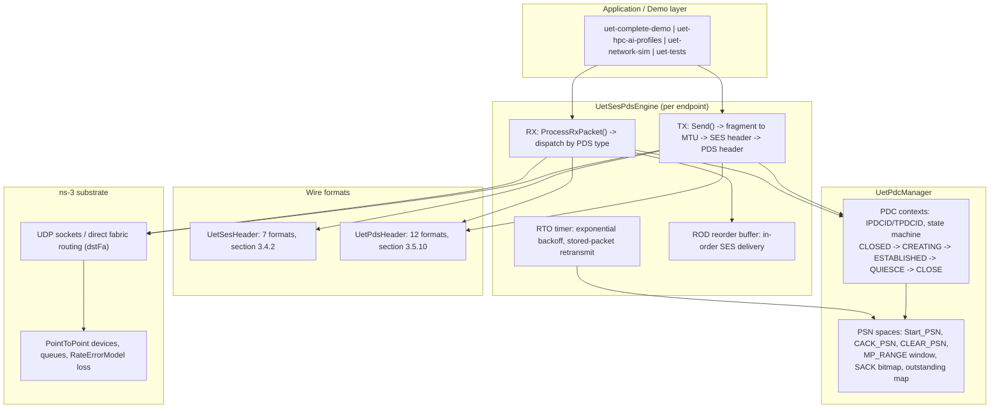

# Ultra Ethernet Transport (UET) in ns-3: SES + PDS Implementation

A working implementation of the **Ultra Ethernet Consortium (UEC) transport layer** inside the
ns-3.36.1 network simulator, covering the **Semantic Sublayer (SES, spec section 3.4)** and the
**Packet Delivery Sublayer (PDS, spec section 3.5)** of UE-Specification 1.0, built on top of the
ns-3-alibabacloud (SimAI) tree.

The stack runs end-to-end over real ns-3 UDP sockets and point-to-point links, delivers messages
reliably under injected packet loss, and is verified by a deterministic 86-check test suite.

## What is Ultra Ethernet?

Ultra Ethernet is the UEC's answer to RoCEv2's shortcomings for AI/HPC fabrics: it replaces the
rigid go-back-N, PFC-dependent RoCE transport with a modern transport offering out-of-order
packet delivery with in-order message semantics, selective retransmission (SACK), ephemeral
connection state (Packet Delivery Contexts, established in-band with zero RTT setup cost), and
multiple delivery modes matched to workload needs:

| Mode | Reliability | Ordering | Use case |
|------|-------------|----------|----------|
| RUD  | Reliable    | Unordered | RDMA writes/reads, gradient allreduce |
| ROD  | Reliable    | Ordered   | MPI collectives, atomics |
| RUDI | Reliable    | Unordered, idempotent | Small datagrams, PDC-less |
| UUD  | Unreliable  | Unordered | Best-effort telemetry |

## What is implemented

**SES (section 3.4)** — all seven wire header formats with exact bit layouts: Standard SOM=1
(44 B) and SOM=0 continuation (32 B), Optimized Non-Matching (20 B), Small-Message (28 B),
Response (12 B), Response-with-Data (20 B), Optimized Response-with-Data (12 B), plus the atomic
extension header. Message fragmentation to MTU, SOM/EOM flags, message offsets, opcodes, return
codes.

**PDS (section 3.5)** — all twelve packet formats (requests, ACK, ACK_CC with 64-bit SACK
bitmap, ACK_CCX, NACK with all twenty NACK codes of Table 3-58, control packets, RUDI
request/response, UUD); PDC lifecycle with in-band SYN establishment, IPDCID/TPDCID exchange,
randomized Start_PSN, per-direction PSN spaces (CACK_PSN, CLEAR_PSN, MP_RANGE windowing);
duplicate detection and re-ACK; guaranteed-delivery response storage with clear-window
management.

**Loss recovery** — stored-packet retransmission driven by an exponential-backoff RTO timer,
SACK-based selective release, NACK-code-specific reactions (retransmit / new-PDC retry /
PDC-fatal teardown), bounded retry budget with explicit per-message failure reporting, and a
target-side reorder buffer that gives ROD in-order delivery without go-back-N retransmit storms.

**Integration and tooling** — an RDMA-hardware bridge layer hooked into the SimAI RdmaHw
RX/completion path, six demo programs (protocol walkthrough, AI/HPC profile workloads, socket
benchmark, drop-injection demo, control-packet scenarios), and a deterministic test suite.

## Architecture



Packet walk (RUD write, first message on a fresh PDC):

1. `Send()` picks or creates a PDC for the tuple (srcFA, dstFA, TC, mode); the initiator
   assigns an IPDCID and a randomized Start_PSN.
2. Each MTU-sized chunk gets an SES header (SOM/EOM, message id, offsets) and a PDS request
   header (PSN, SYN flag while the TPDCID is unknown, spdcid = IPDCID, dpdcid carrying
   pdc_info + psn_offset during SYN).
3. The target sees SYN, allocates a TPDCID, records the PSN, and returns an ACK_CC whose
   spdcid teaches the initiator the TPDCID; the SACK bitmap advertises out-of-order arrivals.
4. ACKs release outstanding packets (cumulative + selective); the completion callback fires
   exactly once per message when its last PSN is acknowledged.
5. A lost packet is retransmitted from the stored wire copy when its RTO expires (100 us
   initial, doubling per retry); after the retry budget (default 7) the message fails loudly.

## Results

Benchmark: 2 nodes, 200 Gbps link, 100 ns propagation delay, 2000 messages of 8192 B,
MTU 4096, seed 1, `RateErrorModel` loss injected on both devices
(`scripts/run_experiments.sh` reproduces every row).

### Reliability and goodput vs injected loss

| Mode | Loss | Completion | Goodput | Retransmits | Avg delivery latency | P99 |
|------|------|-----------|---------|-------------|----------------------|-----|
| RUD | 0%    | 100.00% | 196.27 Gbps | 0   | 7.4 us   | 14.3 us |
| RUD | 0.1%  | 100.00% | 192.96 Gbps | 3   | 10.5 us  | 25.7 us |
| RUD | 1%    | 100.00% | 163.47 Gbps | 63  | 30.5 us  | 151.2 us |
| RUD | 5%    | 100.00% | 100.75 Gbps | 429 | 180.3 us | 519.2 us |
| ROD | 0%    | 100.00% | 196.27 Gbps | 0   | 7.4 us   | 14.3 us |
| ROD | 0.1%  | 100.00% | 192.96 Gbps | 3   | 54.7 us  | 187.0 us |
| ROD | 1%    | 100.00% | 163.47 Gbps | 63  | 155.5 us | 226.9 us |
| ROD | 5%    | 100.00% | 100.75 Gbps | 429 | 438.4 us | 796.4 us |
| RUDI | 1% (4096 B msgs) | 100.00% | 131.03 Gbps | 35 | n/a | n/a |

Every sent message is acknowledged end-to-end at every loss rate; the cost of loss appears
where it should: goodput and tail latency. ROD pays an additional head-of-line-blocking
latency penalty over RUD for the same loss rate, which is exactly the RUD-vs-ROD trade the
UEC spec is built around. Identical seeds produce byte-identical outputs.

### Before / after this audit-and-fix pass

| Metric (lossless 200 Gbps run) | Before | After |
|--------------------------------|--------|-------|
| Messages delivered | 511 / 2000 (25.6%) | 2000 / 2000 (100%) |
| Messages ACKed end-to-end | 0 (ACK path broken) | 2000 (100%) |
| Active PDCs for one flow | 256 (pool exhausted) | 1 |
| Payload bytes delivered | 2.09 MB of 16.38 MB | 16,384,000 of 16,384,000 (byte-exact) |
| Retransmission machinery | none (drops were permanent) | RTO + SACK + NACK recovery |
| ROD under 1% loss | 8% completion | 100% completion |
| Verification | none | 86 deterministic checks, all passing |

The headline defects behind the before column: the wire callback carried no destination
address, so ACKs could not be routed back on any topology with more than one peer; `Pump()`
sent one chunk per message and was never re-driven by ACKs; every `Send()` during the SYN
handshake allocated a fresh PDC until the pool of 256 was exhausted; three PDS wire formats
had serialize/deserialize size mismatches (the CP header overran its buffer by two bytes);
and SOM=0 continuation headers were parsed as SOM=1, silently swallowing 12 payload bytes
per message. Details with file/line references are in [docs/REPORT.md](docs/REPORT.md).

## Repository layout

```
.
├── README.md                  <- you are here
├── docs/
│   ├── GUIDE.md               <- build / run / troubleshoot, all CLI flags
│   └── REPORT.md              <- audit findings, fixes, evaluation methodology
├── scripts/
│   ├── build.sh               <- configure + build everything
│   ├── run_tests.sh           <- 86-check verification suite
│   ├── run_demos.sh           <- all demos in sequence
│   └── run_experiments.sh     <- reproduce the results tables
├── dashboard/                 <- static web visualization of the protocol
├── legacy/                    <- superseded docs kept for history
└── simulation/                <- ns-3.36.1 tree (ns-3-alibabacloud fork)
    ├── scratch/
    │   ├── uet-tests.cc               <- deterministic test suite (T01..T11)
    │   ├── uet-complete-demo.cc       <- 4-node SES/PDS/PDC walkthrough
    │   ├── uet-hpc-ai-profiles.cc     <- AI Base / AI Full / HPC workloads
    │   ├── uet-network-sim.cc         <- socket-level benchmark with loss injection
    │   ├── uet-ses-pds-demo.cc        <- parametric demo with deterministic drops
    │   ├── uet-advanced-demo.cc       <- control packets and target state
    │   └── uet-phase4-rdma-integration.cc
    └── src/point-to-point/model/
        ├── uet-ses-header.{h,cc}      <- SES wire formats (section 3.4)
        ├── uet-pds-header.{h,cc}      <- PDS wire formats (section 3.5.10)
        ├── uet-pdc.{h,cc}             <- PDC manager, PSN spaces, state machines
        ├── uet-ses-pds-engine.{h,cc}  <- transaction engine, RTO, reorder buffer
        ├── uet-pds-control-packet.{h,cc}
        ├── uet-pds-target-state.{h,cc}
        └── rdma-hw-uet-integration.{h,cc}
```

## Quick start

Prerequisites: C++17 compiler (clang or gcc), CMake 3.10+, Python 3. Tested on macOS
(Apple Silicon) and Linux.

```bash
# 1. Build everything (first build takes a while; ns-3 is large)
scripts/build.sh

# 2. Prove the stack works: 11 tests, 86 checks, deterministic
scripts/run_tests.sh

# 3. Watch the protocol run end-to-end
scripts/run_demos.sh complete        # 4-node SES/PDS/PDC walkthrough
scripts/run_demos.sh network         # 200 Gbps benchmark, lossless + 1% loss

# 4. Reproduce the results tables
scripts/run_experiments.sh
```

Direct binary invocation (after building):

```bash
cd simulation
./build/scratch/ns3.36.1-uet-network-sim-debug \
    --numMsgs=2000 --msgSize=8192 --mode=ROD --lossRate=0.01 --seed=1
```

See [docs/GUIDE.md](docs/GUIDE.md) for every program, flag, and troubleshooting entry.

## Tech stack

- **ns-3.36.1** (ns-3-alibabacloud / SimAI fork) - discrete-event network simulation
- **C++17** - protocol implementation as ns-3 `Header` / `Object` classes
- **CMake + ns3 wrapper** - build system
- **Bash** - reproduction scripts
- Reference: UEC UE-Specification 1.0 (sections 3.4 SES, 3.5 PDS); the spec PDF is
  copyrighted by the Ultra Ethernet Consortium and is intentionally not in this repository

## Relation to published work

- **DCQCN (SIGCOMM 2015)** and **TIMELY (SIGCOMM 2015)** motivate why lossless RoCE fabrics
  need congestion control; UET instead tolerates loss at the transport layer. This project
  implements the loss-tolerant transport, not the congestion-control algorithms (the CC
  header fields ACK_CC/ACK_CCX are carried but no CC state machine runs).
- **IRN (SIGCOMM 2018)** showed selective retransmission beats go-back-N for RDMA; the same
  result reproduces here: replacing NACK-and-drop ROD recovery with SACK plus a target-side
  reorder buffer took ROD-under-1%-loss from 8% to 100% completion.
- **Swift (SIGCOMM 2020)** style delay-based CC is a natural future addition on top of the
  carried CC state fields.
- The ns-3-alibabacloud base tree is the SimAI simulator from Alibaba; its RDMA/QBB stack
  coexists with this UET module and the bridge layer hooks UET tracking into the RdmaHw
  receive path.

## Honest limitations

- **No congestion control.** CC header formats are serialized correctly, but no CCC/credit
  algorithm runs; the benchmark link is a single uncontended hop.
- **Single path.** Entropy-based packet spraying / multipathing (a headline UET feature) is
  not modeled; there is one path, so reordering only arises from loss.
- **No TSS/encryption**, no trimming-based fast loss signaling (NACK codes for trimming exist
  and are handled, but no switch trims packets in these topologies).
- **Retransmitted packets do not set the retx wire flag** (stored copies are resent
  verbatim); duplicate detection at the target makes this behaviorally invisible here, but a
  spec-conformance harness would flag it.
- **RUDI dedup state is unbounded** (a set of seen pkt_ids per peer); fine for simulations,
  not for a production endpoint.
- **RUDI latency is not measured** in the benchmark (small-message SES format carries no
  message id for the timestamp map).
- The RdmaHw bridge tracks UET state alongside the existing SimAI RDMA path rather than
  replacing its go-back-N recovery; full datapath substitution is future work.
- Simulation only: no NIC offload model, no host memory bandwidth effects.

## Reproduction

Every number in this README comes from a committed script:

```bash
scripts/build.sh              # build
scripts/run_tests.sh          # correctness: expect "86/86 checks passed"
scripts/run_experiments.sh    # results/: one file per mode x loss configuration
SEED=2 scripts/run_experiments.sh   # different seed, same conclusions
```

## License

The ns-3 base tree keeps its GPLv2 license (see `LICENSE`). UET module code follows the same
license as the tree it lives in.
